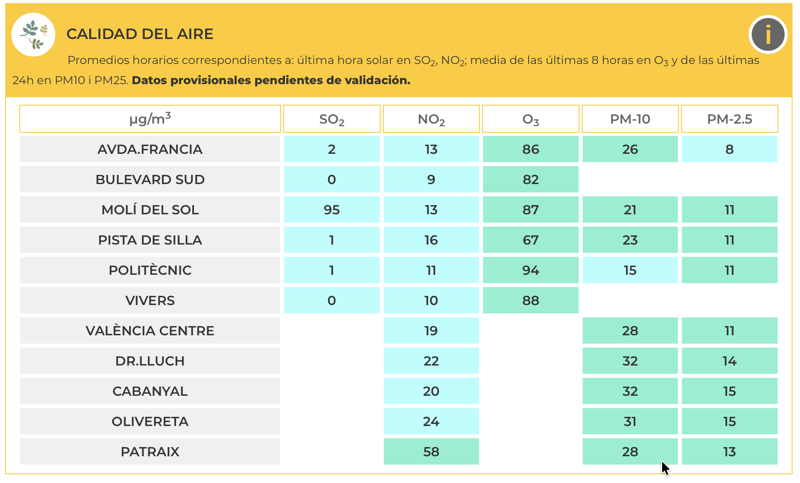
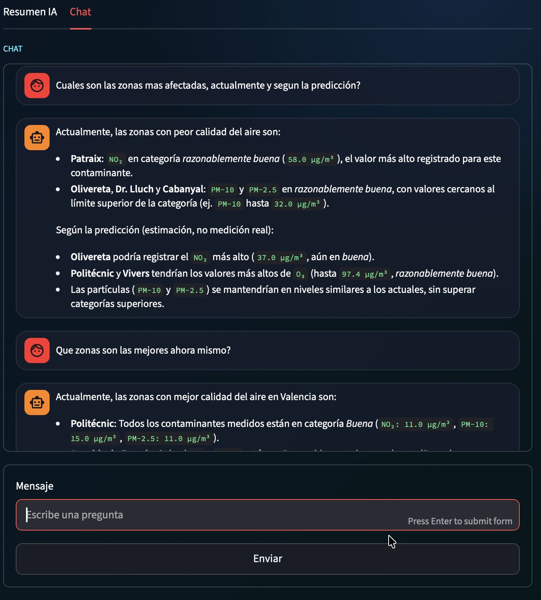
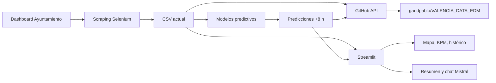

# Valencia Respira

Valencia Respira es una aplicación de Streamlit para seguir la calidad del aire de Valencia, comparar mediciones actuales con predicciones a corto plazo y preguntar a un asistente IA por zonas, contaminantes o evolución prevista.

La app pública está disponible en:

[https://valencia-respira-valencia.streamlit.app/~/+/?chat_check=1804288](https://valencia-respira-valencia.streamlit.app/~/+/?chat_check=1804288)

## Qué Hace

La aplicación convierte una tabla municipal dispersa en una experiencia de consulta continua:

- Extrae automáticamente los datos actuales del dashboard del Ayuntamiento de Valencia.
- Normaliza los valores por estación y contaminante.
- Genera predicciones, principalmente a +8 horas, con modelos entrenados por zona y contaminante.
- Publica mediciones y predicciones en un repositorio de datos para conservar histórico operativo.
- Muestra mapas, KPIs, histórico scrapeado, tablas de seguimiento y explicación de umbrales.
- Incluye resumen y chatbot con Mistral, alimentados con el contexto de datos actuales y predicciones.

### Origen de datos municipal



### Vista principal


### Resumen y chatbot



## Fuentes de Datos

Los datos actuales se descargan mediante scraping del dashboard municipal:

[https://www.valencia.es/valenciaalminut/](https://www.valencia.es/valenciaalminut/)

Ese dashboard publica una tabla con valores de SO2, NO2, O3, PM-10 y PM-2.5 en distintas zonas de Valencia. Los valores se actualizan aproximadamente cada 8-24 horas, por lo que la app comprueba si la medición ha cambiado antes de guardar una nueva instantánea histórica.

Para entrenar los modelos se usaron datos históricos horarios de calidad del aire publicados en el portal Open Data VLCi:

[Hourly air quality data since 2016](https://opendata.vlci.valencia.es/dataset/hourly-air-quality-data-since-2016/resource/c0b0c66f-08de-4a41-a316-1f5a78646ad7)

El histórico disponible cubre 2016-2025 con frecuencia horaria. En este repo se conserva ya procesado por estación en `data/time/`, lo que permite construir variables temporales, retardos y ventanas móviles para cada contaminante.

## Flujo de Datos



Al entrar en la app y pulsar `ACCEDER`, se ejecuta `run_manual_pipeline()`:

1. Sincroniza el histórico remoto disponible en [gandpablo/VALENCIA_DATA_EDM](https://github.com/gandpablo/VALENCIA_DATA_EDM).
2. Abre el dashboard municipal con Selenium y extrae la tabla `tabla_dinamica`.
3. Guarda `data/scraped/latest.csv`.
4. Si la tabla cambió, añade un snapshot en `data/scraped/history/`.
5. Genera predicciones en `predictions/latest.csv` y `predictions/history/`.
6. Sube mediciones, predicciones e índices JSON al repositorio remoto mediante la API de GitHub.

Este repositorio remoto funciona como almacén incremental para seguir la evolución real de la app y generar históricos que permitan reentrenar los modelos.

## Modelos Predictivos

Los modelos se entrenaron con Ridge Regression a partir del histórico horario 2016-2025. Hay modelos independientes por estación, contaminante y horizonte temporal.

En `models/builded/` se incluyen:

- `registry.json`: catálogo de modelos disponibles.
- `metrics.csv`: métricas de entrenamiento, test y validación.
- `model__*.json`: artefactos serializados con coeficientes, escalado, límites y metadatos.

El registro actual contiene 64 entradas:

- 32 modelos para horizonte +8 horas.
- 32 modelos para horizonte +24 horas.

La app usa el horizonte +8 horas para la predicción operativa. Cada modelo se evalúa frente a una baseline de persistencia; cuando Ridge no mejora la baseline, el pipeline conserva la estrategia más robusta para evitar degradar la predicción.

Las variables de entrada incluyen:

- Valores actuales de contaminantes.
- Lags horarios del contaminante objetivo.
- Medias móviles de 24 horas y 7 días cuando aplica.
- Codificación cíclica de hora, día de la semana y mes.
- Recorte a rangos vistos durante entrenamiento para evitar extrapolaciones extremas.

## IA Conversacional

El módulo `app/air_quality_llm.py` construye un contexto dinámico con:

- Tabla actual scrapeada.
- Tabla de predicciones.
- Umbrales de calidad del aire.
- Definiciones de contaminantes y unidades.

Ese contexto se envía a Mistral para generar:

- Un resumen general de la situación.
- Respuestas a preguntas concretas sobre zonas, contaminantes, comparaciones o predicciones.

El prompt distingue explícitamente entre mediciones reales y predicciones para no presentar estimaciones como datos observados.

## Estructura del Repo

```text
.
├── app/
│   ├── streamlit_app.py      # Interfaz principal
│   ├── pipeline.py           # Scraping, predicción y subida a GitHub
│   └── air_quality_llm.py    # Resumen y chatbot con Mistral
├── data/
│   ├── time/                 # Histórico horario procesado por estación
│   └── scraped/              # Mediciones actuales e histórico scrapeado
├── models/
│   ├── train_models.ipynb    # Entrenamiento de modelos
│   ├── evaluate_models.ipynb # Evaluación
│   └── builded/              # Modelos y métricas serializadas
├── predictions/              # Predicciones actuales e histórico
├── Scraper/                  # Notebook exploratorio del scraping
├── tests/                    # Tests del pipeline y prompts
├── docs/assets/              # Capturas reales del README
├── requirements.txt
└── packages.txt
```

## Instalación Local

Requisitos recomendados:

- Python 3.11.
- Chrome, Chromium o Google Chrome disponible para Selenium.
- Un token de GitHub con permiso de escritura sobre el repositorio de datos.
- Una clave de Mistral para resumen y chatbot.

### 1. Crear Entorno

```bash
python3.11 -m venv .venv
source .venv/bin/activate
python -m pip install --upgrade pip
pip install -r requirements.txt
```

### 2. Instalar Navegador Para Scraping

En Streamlit Community Cloud se usa `packages.txt`:

```text
chromium
chromium-driver
```

En local, instala Chrome/Chromium y, si Selenium no resuelve el driver automáticamente, instala también `chromedriver`.

En Debian/Ubuntu:

```bash
sudo apt-get update
sudo apt-get install chromium chromium-driver
```

En macOS suele bastar con Google Chrome instalado. Si usas Homebrew:

```bash
brew install --cask google-chrome
```

### 3. Configurar Secretos

La app necesita dos variables:

```bash
export MISTRAL_API_KEY="tu_clave_mistral"
export EDM_GITHUB_TOKEN="tu_token_github"
```

También admite un archivo local `.confing` en la raíz del proyecto, que está ignorado por Git:

```text
MISTRAL_API_KEY="tu_clave_mistral"
EDM_GITHUB_TOKEN="tu_token_github"
```

En Streamlit Community Cloud, define esos valores como secretos de nivel raíz para que estén disponibles como variables de entorno.

### 4. Ejecutar La App

```bash
streamlit run app/streamlit_app.py
```

Al abrir la app:

1. Se muestra una pantalla inicial.
2. Al pulsar `ACCEDER`, la app comprueba si hay una medición nueva.
3. Si hay cambios, actualiza histórico local y remoto.
4. Calcula predicciones y carga el dashboard.

La primera carga puede tardar más porque ejecuta Selenium, consulta GitHub y genera predicciones.

## Tests

```bash
python -m unittest discover -s tests
```

Los tests cubren:

- Sincronización de histórico remoto.
- Detección de snapshots duplicados.
- Consistencia del registro de modelos.
- Salida de predicciones no vacía y no negativa.
- Construcción de prompts del chatbot.

## Despliegue

La app ya está desplegada en Streamlit:

[https://valencia-respira-valencia.streamlit.app/~/+/?chat_check=1804288](https://valencia-respira-valencia.streamlit.app/~/+/?chat_check=1804288)

Configuración usada:

- Entrypoint: `app/streamlit_app.py`
- Python: `3.11`
- Dependencias Python: `requirements.txt`
- Dependencias del sistema: `packages.txt`
- Secretos: `MISTRAL_API_KEY` y `EDM_GITHUB_TOKEN`

## Notas de Uso

- Las mediciones proceden del dashboard municipal y pueden ser provisionales.
- No todas las estaciones publican todos los contaminantes.
- Las predicciones son estimaciones, no mediciones reales.
- Los colores siguen los rangos del Índice Nacional de Calidad del Aire usados en la app.
- El histórico operativo crece a medida que la app detecta snapshots nuevos y los sube a GitHub.
